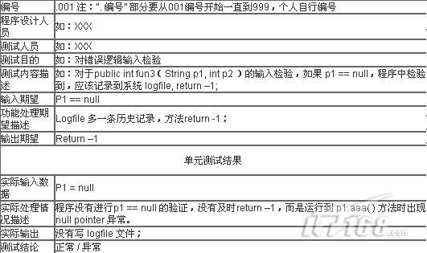

# 单元测试步骤

　　在代码编写完成后的单元测试工作主要分为两个步骤人工静态检查和动态执行跟踪。

　　人工静态检查是测试的第一步，这个阶段工作主要是保证代码算法的逻辑正确性(尽量通过人工检查发现代码的逻辑错误)、清晰性、规范性、一致性、算法高效性。并尽可能的发现程序中没有发现的错误。

　　第二步是通过设计测试用例，执行待测程序来跟踪比较实际结果与预期结果来发现错误。经验表明，使用人工静态检查法能够有效的发现30%到70%的逻辑设计 和编码错误。但是代码中仍会有大量的隐性错误无法通过视觉检查发现，必须通过跟踪调试法细心分析才能够捕捉到。所以，动态跟踪调试方法也成了单元测试的重点与难点。

## 人工检查

　　通常在人工检查阶段必须执行以下项目的活动：

　　第一、 检查算法的逻辑正确性;确定所编写的代码算法、数据结构定义(如：队列、堆栈等)是否实现了模块或方法所要求的功能。

　　第二、 模块接口的正确性检查;确定形式参数个数、数据类型、顺序是否正确;确定返回值类型及返回值的正确性。

　　第三、 输入参数有没有作正确性检查;如果没有作正确性检查，确定该参数是否的确无需做参数正确性检查，否则请添加上参数的正确性检查。经验表明，缺少参数正确性检查的代码是造成软件系统不稳定的主要原因之一。

　　第四、 调用其他方法接口的正确性;检查实参类型正确与否、传入的参数值正确与否、个数正确与否，特别是具有多态的方法。返回值正确与否，有没有误解返回值所表示 的意思。最好对每个被调用的方法的返回值用显湿代码作正确性检查，如果被调用方法出现异常或错误程序应该给予反馈，并添加适当的出错处理代码。

　　第五、 出错处理;模块代码要求能预见出错的条件，并设置适当的出错处理，以便在一旦程序出错时，能对出错程序重做安排，保证其逻辑的正确性，这种出错处理应当是 模块功能的一部分。若出现下列情况之一，则表明模块的错误处理功能包含有错误或缺陷：出错的描述难以理解;出错的描述不足以对错误定位，不足以确定出错的 原因;显示的错误信息与实际的错误原因不符;对错误条件的处理不正确;在对错误进行处理之前，错误条件已经引起系统的干预等。

　　第六、 保证表达式、SQL语句的正确性;检查所编写的SQL语句的语法、逻辑的正确性。对表达式应该保证不含二义性，对于容易产生歧义的表达式或运算符优先级 (如：《 、=、 》、 &&、||、++、 --等)可以采用扩号“()”运算符避免二义性，这样一方面能够保证代码的正确可靠，同时也能够提高代码的可读性。

　　第七、 检查常量或全局变量使用的正确性;确定所使用的常量或全局变量的取值和数值、数据类型;保证常量每次引用同它的取值、数值和类型的一致性。

　　第八、 表示符定义的规范一致性;保证变量命名能够见名知意，并且简洁但不宜过长或过短、规范、容易记忆、最好能够拼读。并尽量保证用相同的表示符代表相同功能，不要将不同的功能用相同的表示符表示;更不要用相同的表示符代表不同的功能意义。

　　第九、 程序风格的一致性、规范性;代码必须能保证符合企业规范，保证所有成员的代码风格一致、规范、工整。例如对数组做循环，不要一会儿采用下标变量从下到上的 方式(如：for(I=0;I++;I<10))，一会儿又采用从上到下的方式(如：for(I=10;I--;I>0));应该尽量采用统 一的方式，或则统一从下到上，或则统一从上到下。建议采用for循环和While循环，不要采用do{}while循环等。

　　第十、 检查程序中使用到的神秘数字是否采用了表示符定义。神秘的数字包括各种常数、数组的大小、字符位置、变换因子以及程序中出现的其他以文字形式写出的数值。 在程序源代码里，一个具有原本形式的数对其本身的重要性或作用没提供任何指示性信息，它们也导致程序难以理解和修改。对于这类神秘数字必须采用相应的标量 来表示;如果该数字在整个系统中都可能使用到务必将它定义为全局常量;如果该神秘数字在一个类中使用可将其定义为类的属性(Attribute)，如果该 神秘数字只在一个方法中出现务必将其定义为局部变量或常量。

　　第十一、 检查代码是否可以优化、算法效率是否最高。如：SQL语句是否可以优化，是否可以用1条SQL语句代替程序中的多条SQL语句的功能，循环是否必要，循环中的语句是否可以抽出到循环之外等。

　　第十二、 检查您的程序是否清晰简洁容易理解。注意：冗长的程序并不一定不是清晰的。

　　第十三、 检查方法内部注释是否完整;是否清晰简洁;是否正确的反映了代码的功能，错误的注释比没有注释更糟;是否做了多余的注释;对于简单的一看就懂的代码没有必要注释。

　　第十四、 检查注释文档是否完整;对包、类、属性、方法功能、参数、返回值的注释是否正确且容易理解;是否会落了或多了某个参数的注释，参数类型是否正确，参数的限 定值是否正确。特别是对于形式参数与返回值中关于神秘数值的注释，如：类型参数 应该指出 1.代表什么，2.代表什么，3.代表什么等。对于返回结果集(Result Set)的注释，应该注释结果集中包含那些字段及字段类型、字段顺序等。

## 动态执行跟踪

　　动态执行测试通常分为黑盒测试与白盒测试。黑盒测试指已知产品的功能设计规格，可以进行测试证明每个实现了的功能是否符合要求。白盒测试指已知产品的内部工作过程，可以通过测试证明每种内部操作是否符合设计规格的要求，所有内部成分是否已经经过检查。

　　对于单元测试来说主要应该采用白盒测试法对每个模块的内部作跟踪检查测试。对于单元白盒测试，应该对程序模块进行如下检查：

　　1. 对模块内所有独立的执行路径至少测试一次;

　　2. 对所有的逻辑判定，取“真”与“假”的两种情况都至少执行一次;

　　3. 在循环的边界和运行界限内执行循环体;

　　4. 测试内部数据的有效性等等。

　　单元白盒跟踪测试，通常需要做如下三项工作：

　　1. 设计测试用例;

　　2. 设计测试类模块;

　　3. 跟踪调试。

### 测试用例设计

　　通常动态执行跟踪调试是在编码阶段进行的。在对源程序作静态人工检查之后就可以开始进行单元测试的测试用例设计。利用设计文档，设计可以验证程序功能、找出程序错误的多个测试用例。

#### 测试用例的设计基本原则

　　设计测试用例基本的原则是：

　　1. 一个好的测试用例在于能够发现至今没有发现的错误;

　　2. 测试用例应由测试输入数据和与之对应的预期输出结果这两部分组成;

　　3. 在测试用例设计时，应当包含合理的输入条件和不合理的输入条件。

#### 白盒测试的测试用例设计

　　白盒测试测试用例一般采用逻辑覆盖法和基本路径法进行设计。

** 逻辑覆盖法 **

　　逻辑覆盖是以程序内部的逻辑结构为基础的测试用例设计技术，这一方法要求测试人员对程序的逻辑结构有清楚的了解。逻辑覆盖可分为：语句覆盖、判定覆盖、条件覆盖、判定-条件覆盖、条件组合覆盖与路径覆盖。

　　1. 语句覆盖就是设计若干个测试用例，运行所测程序，使得每一可执行语句至少执行一次。

　　2. 判定覆盖就是设计若干个测试用例，运行所测程序，使得程序中每个判断的取真分支和取假分支至少经历一次。

　　3. 条件覆盖就是设计若干个测试用例，运行所测程序，使得程序中每个判断的每个条件的可能取值至少执行一次。

　　4. 判定--条件覆盖就是设计足够的测试用例，使得判断中每个条件的所有可能取值至少执行一次，同时每个判断的所有可能判断结果也至少执行一次。

　　5. 条件组合覆盖就是设计足够的测试用例，运行所测程序，使得每个判断的所有可能的条件取值组合至少执行一次。

　　6. 路径测试就是设计足够的测试用例，覆盖程序中所有可能的路径。

　　每一种覆盖方法都有其优缺点，这6种覆盖方法关系，如图1：

　　 

　　通常在设计测试用例时应该根据代码模块的复杂度，选择覆盖方法。一般的代码的复杂度与测试用例设计的复杂度成正比。因此，设计人员必须做到模块或方法功能 的单一性、高内聚性，使得方法或函数代码尽可能的简单;这样将可大大提高测试用例设计的容易度，提高测试用例的覆盖程度。

** 基本路径法 **

　　基本路径测试法是在程序控制流图的基础上，通过分析控制构造的环路复杂性，导出基本可执行路径集合，从而设计测试用例的方法。设计出的测试用例要保证在测试中程序的每个可执行语句至少执行一次。基本路径测试法包括以下5个方面：

　　1. 程序的控制流图：描述程序控制流的一种图示方法。

　　2. 程序环境复杂性：McCabe复杂性度量;从程序的环路复杂性可导出程序基本路径集合中的独立路径条数，这是确定程序中每个可执行语句至少执行依次所必须的测试用例数目的上界。

　　3. 导出测试用例。

　　4. 准备测试用例，确保基本路径集中的每一条路径的执行。

　　5. 图形矩阵：是在基本路径测试中起辅助作用的软件工具，利用它可以实现自动地确定一个基本路径集。

　　另外，对于测试用例的选择除了满足所选择的覆盖程度(或覆盖标准)外还需要尽可能的采用边界值分析法、错误推测法等常用地设计方法。采用边界值分析法设计 合理的输入条件与不合理的输入条件;条件边界测试用例应该包括输入参数的边界与条件边界(if，while，for，switch ，SQL Where子句等)。错误推测法，列举出程序中所有可能的错误和容易发生错误的特殊情况，根据它们选择测试用例;在编码、单元测试阶段可以发现很多常见的 错误和疑似错误，对于这些错误应该作重点测试，并设计相应的测试用例。

#####  单元测试计划表格

　　在设计测试用例时可以参考如下表格，拟定对每个类(或模块或包)的测试计划。表1，是对每个类(或模块或包)作测试计划的表头，它指明本测试计划是针对那个模块及相关文件的。表2是针对表1指定模块测试用例而对应的子表，每个测试用例可以拥有一个子表;单元测试结果子表留作执行测试用例时根据实际结果填写。

　　子系统名. PackageName. JavaClassName

　 

　　单元测试子项001

　　下面表格为针对上面表格“子系统名. PackageName. JavaClassName”而对应的子表，每个测试用例用一张子表：

　　

## 测试类设计

　　一个模块或一个方法(Method)并不是一个独立的程序，在考虑测试它时要同时考虑它和外界的联系，用些辅助模块去模拟与所测模块相联系的其他模块。这些辅助模块分为两种：

　　1. 驱动模块(driver)：相当于所测模块的主程序。它接收测试数据，把这些数据传送给所测模块，最后再输出实际测试结果。

　　2. 桩模块(stub)：用于代替所测模块调用的子模块。桩模块可以做少量的数据操作，不需要把子模块所有功能都带进来，但不容许什么事情也不做。

　　所测模块与它相关的驱动模块及桩模块共同构成了一个“测试环境”，如图2。驱动模块和桩模块的编写会给测试带来额外的开销。因为它们在软件交付时不作为产 品的一部分一同交付，而且它们的编写需要一定的工作量。特别是桩模块，不能只简单地给出“曾经进入”的信息。为了能够正确的测试软件，桩模块可能需要模拟 实际子模块的功能，这样桩模块的建立就不是很轻松了。

　　
   

　　编写桩模块是困难费时的，其实也是完全可以避免编写桩模块的;只需在项目进度管理时将实际桩模块的代码编写工作安排在被测模块前编写即可。而且这样可以提 高测试工作的效率，提高实际桩模块的测试频率从而更有效的保证产品的质量。但是，为了保证能够向上一层级提供稳定可靠的实际桩模块，为后续模块测试打下良 好的基础，驱动模块还是必不可少的。

　　对于每一个包或子系统我们可以根据所编写的测试用例来编写一个测试模块类来做驱动模块，用于测试包中所有的待测试模块。而最好不要在每个类中用一个测试函数的方法，来测试跟踪类中所有的方法。这样的好处在于：

　　1. 能够同时测试包中所有的方法或模块，也可以方便的测试跟踪指定的模块或方法。

　　2. 能够联合使用所有测试用例对同一段代码执行测试，发现问题。

　　3. 便以回归测试，当某个模块作了修改之后，只要执行测试类就可以执行所有被测的模块或方法。这样不但能够方便得检查、跟踪所修改的代码，而且能够检查出修改对包内相关模块或方法所造成的影响，使修改引进的错误得以及时发现。

　　4. 复用测试方法，使测试单元保持持久性，并可以用既有的测试来编写相关测试。

　　5. 将测试代码与产品代码分开，使代码更清晰、简洁;提高测试代码与被测代码的可维护性。

## 跟踪调试

　　跟踪调试不但是深入测试代码的最佳方法，而且也是程序调试发现错误根源的有利工具。

　　测试类设计完成后，最好能借助代码排错工具来跟踪调试待测代码段以深入的检查代码的逻辑错误。现有的代码开发工具(如：JBuilder)一般都集成了这 类排错工具。排错工具一般由执行控制程序、执行状态查询程序、跟踪程序组成。执行控制程序包括断点定义、断点撤销、单步执行、断点执行、条件执行等功能。 执行状态查询程序包括寄存器、堆栈状态、变量、代码等与程序相关的各种状态信息的查询。跟踪程序用以跟踪程序执行过程中所经历的事件序列(如：分支、子程 序调用等)。程序员可通过对程序执行过程中各种状态的判别进行程序错误的识别、定位及改正。

　　对于模块的单元跟踪调试，最好能够做到对被测模块的每次修改，都对每个测试用例进行跟踪执行一遍以排除所有可能出现或引进的错误。在时间有限的情况下也必须调用驱动模块对所有的测试用例执行一次，并对出现错误或异常的测试用例跟踪执行一次，以发现问题的根源。

　　排错过程往往是一个艰苦的过程，特别是那种算法复杂、调用子模块较多的模块，对于错误的定位来说并不是一件容易的事情。尽管排错不是一门好学的技术(有时人们更愿意称之为艺术)，但还是有若干行之有效的方法和策略，下面介绍几种排错时应该采用的方法策略。

　　1. 断点设置，设置断点对源程序实行断点跟踪将能够大大提高排错的效率。通常断点的设置除了根据经验与错误信息来设置外，还应重点考虑以下几种类行的语句。

　　1) 函数调用语句。子函数的调用语句是测试的重点，一方面由于在调用子函数时可能引起接口引用错误，另一方面可能是子函数本身的错误。

　　2) 判定转移/循环语句。判定语句常常会由于边界值与比较优先级等问题引起错误或失效而作出错误的转移。因此，对于判定转移/循环语句也是一个重要的测试点。

　　3) SQL语句。对于数据库的应用程序来说，SQL语句常常会在模块中占比较重要的业务逻辑，而且比较复杂。因此，它也属于比较容易出现错误的语句。

　　4) 复杂算法段。出错的概率常与算法的复杂度成正比。所以越复杂的算法越需要作重点跟踪，如递归、回朔等算法。

　　2. 可疑变量查看，在跟踪执行状态下当程序停止在某条语句时可以查看变量的当前值和对象的当前属性。通过对比这些变量当前值与预期值可以轻松的定位程序问题根源。

　　3. SQL语句执行检查，在跟踪执行或运行状态下将疑似错误的SQL语句打印出来，重新在数据库SQL查询分析器(如：Oracle SQL Plus)中跟踪执行可以较高效的检查纠正SQL语句错误。

　　4. 注意群集现象，经验表明测试后程序中残存的错误数目与该程序中已发现的错误数目或检错率成正比。根据这个规律，应当对错误群集的程序段进行重点测试，以提 高测试投资的效益。如果发现某一代码段似乎比其他程序模块更多的错误倾向时，则应当花费较多的时间和代价测试这个程序模块。
